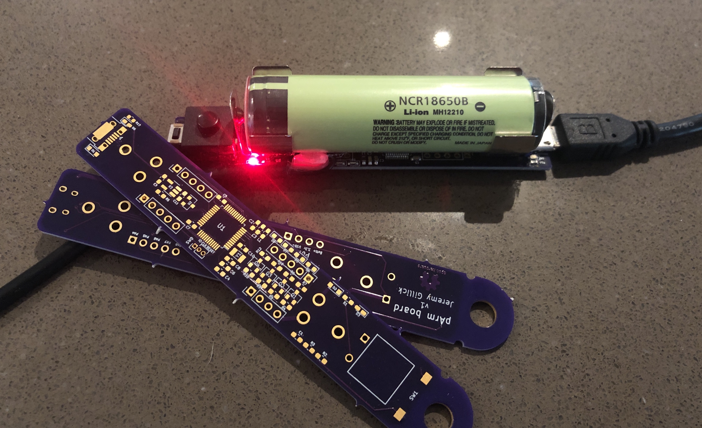
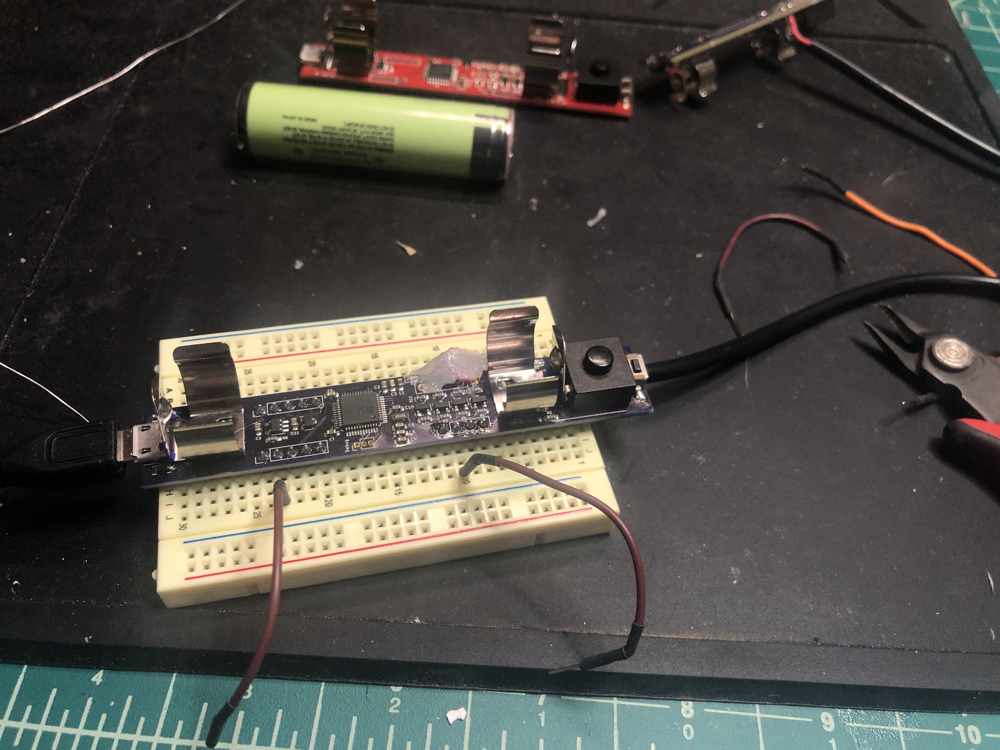
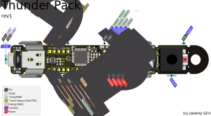

# Thunder Pack

A kick-ass ARM board with everything you need all in a compact package that fits in your pocket. Integrated battery, power management system, USB bootloader, 4 high-power PWM outputs, and 10 GPIOs.

Why? After stringing together countless portable LED controllers that consisted of wiring a flat lipo battery to a charge controller to a switch to an arduino nano, I wanted something better. I always found those versions to be janky, unpleasant and fragile -- not to mention concern that damaging the battery might make it explode! This board has everything I need with room to expand.

* [Overview](https://github.com/jgillick/ThunderPack/wiki/)
* [Getting started](https://github.com/jgillick/ThunderPack/wiki/Getting-Started)
* [Pins & functions](/jgillick/ThunderPack/wiki/Pinout-Details)
* [History & build log](https://hackaday.io/project/161054-lit-fist)

## Features

* Ultra-low-power 32-bit microcontroller ([STM32L072xx](https://www.st.com/resource/en/datasheet/stm32l072v8.pdf))
* Integrated high-capacity 18650 lithium battery
* 4 high-current PWM outputs (2.3A per channel!) with an LED on each for debugging.
* 12 GPIOs, USART, I2C, SPI, USB
* 6k EEPROM
* USB bootloader
* Tactile on/off switch
* Tactile user button with built-in debounce circuit
* Breadboard friendly
* Durable [AF](https://www.urbandictionary.com/define.php?term=af)! (Put a tube of heat shrink around it for a super easy case, if you'd like.)

_Breadboard friendly_

## Board & Pinout

[See the full list of pins and details.](/jgillick/ThunderPack/wiki/Pinout-Details)