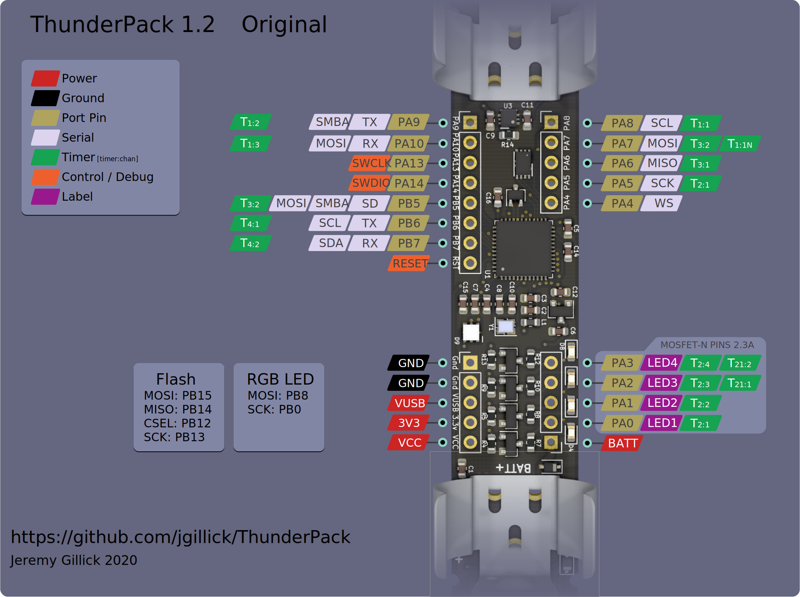

# ThunderPack

A kick-ass microcontroller board with everything you need in a tiny package that fits in your pocket. Integrated battery & power management system, fast ARM microcontroller, USB bootloader, 4 high-power PWM outputs, 12 GPIOs, satisfying pushbutton switch, and more.

After years of wiring together portable LED controllers that all consisted of a lithum batter, charge controller, shitty slide power switch, and an arduino nano (or similar), I wanted something better. I always found those versions to be janky and fragile -- not to mention concerned that damaging the pouch cell battery might make it explode in my pocket! This board has everything I need with room to expand.

* [Overview](https://github.com/jgillick/ThunderPack/wiki/)
* [Getting started](https://github.com/jgillick/ThunderPack/wiki/Getting-Started)
* [Pins & functions](https://github.com/jgillick/ThunderPack/wiki/Pinout-Details)
* [Example Programs](./examples)
* [Project log](https://hackaday.io/project/161054-lit-fist)

## Features

* Fast 90Mhz 32-bit microcontroller ([STM32F11xx](https://www.st.com/resource/en/datasheet/stm32f411ce.pdf))
* Integrated high power 500mA lithium battery charger
* 4 high-current PWM outputs (1.4 - 2.3A per channel!) with an LED on each for debugging.
* Additional 12 GPIOs (USART, I2C, SPI, USB)
* 16MB onboard flash
* RGB DotStar LED
* Built-in USB
* Tactile on/off switch
* Momentary button with built-in debounce circuit
* Breadboard friendly
* Supports Arduino & CircuitPython.

## Board & Pinout

### v1.2 Compact
The newest & smallest Thunderpack, measuring in at a minuscule 4cm x 1.9cm (1.6 x 0.75 inches)! The PWM pins on this model can each drive 1.4A to ground (common cathode).

[See the full list of pins and details.](https://github.com/jgillick/ThunderPack/wiki/Pinout-Details)

### v1.2 Original
This is the original ThunderPack form factor and has the battery attached right to the circuit board. The PWM pins on this model can each drive 2.3A to ground (common cathode).

[See the full list of pins and details.](https://github.com/jgillick/ThunderPack/wiki/Pinout-Details)
