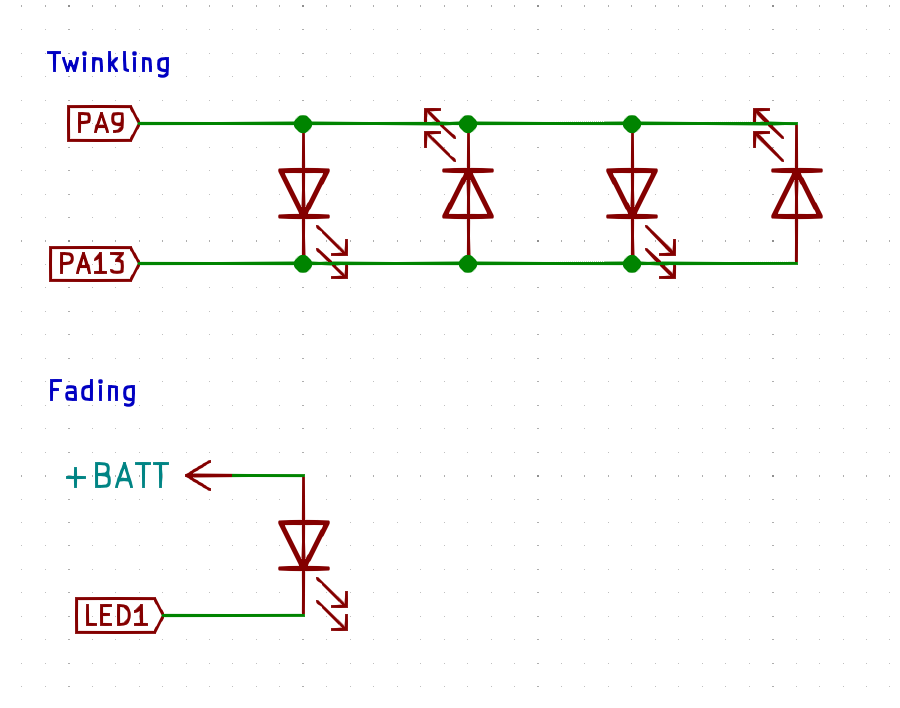

# CircuitPython Twinkle Stars

This is a CircuitPython program which uses a few outputs and some fairy string lights to produce a cool twinkling stars effect. Some LEDs are set to twinkle on and off, while others will have a longer fade up and down.

## How Fairy String LEDs Help

Often fairy string lights wire up their LEDs parallel with alternating polarities. This way, when wire 1 is positive and wire 2 is negative, every second LED is illuminated. When the polarity of the wires reverses (wire 1: negative, wire 2: positive) the other LEDs turn on.

This clever technique let's fairy string lights do a variety of animations with fewer wires by swapping the polarities at different rates.

## Setup

There will be two groups of LEDs: twinkling and fading. The fading LEDs will just fade on and off. The twinkling LEDs will swap the power polarity to a string of LEDs with randomized timing.

### Fade LEDs

Connect LEDs to the first three PWM outputs, ensuring you have the polarity correct. The fading LEDS will not use the swapped polarity feature.

### Twinkle LEDs

Cut a string of fairy lights into sections. Test the current draw on each twinkle section and make sure it does not draw more than 20mA. If it does, you might need to add a mosfet to protect the microcontroller. Add an inline resistor as necessary.

Take each section and connect one of the wires to one GPIO and the other one to another GPIO. I used: `PA9`, `PA13`, `PA14`, and `PB5`.

