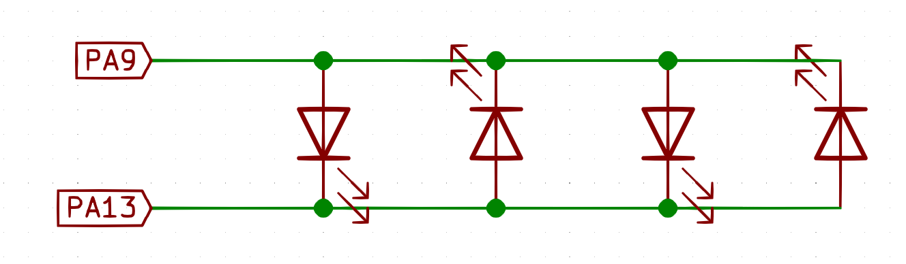

# CircuitPython Twinkle Stars

This is a CircuitPython program which uses 6 outputs and some fairy string lights to produce a twinkling stars effect. The result will have a bunch of LEDs which are flickerig and some which are fading on and off.

## How Fairy String LED Lights Work

Often fairy string lights wire up their LEDs parallel with alternating polarities. This way, when wire 1 is positive and wire 2 is negative, every second LED is illuminated. When the polarity of the wires reverses (wire 1: negative, wire 2: positive) the other LEDs turn on, instead. This let's fairy string lights do a few differet flashing animations by swapping power polarities at different rates.

## Setup

There will be two groups of LEDs: twinkling and fading. The fading LEDs will just fade on and off. The twinkling LEDs will swap the power polarity to a string of LEDs with randomized timing.

### Fade LEDs

Connect LEDs or fairy strings to the PWM/LED outputs, ensuring you have the polarity correct. The fading sections will not exploit the swapped polarity feature.

### Twinkle LEDs

Cut a string of fairy lights into sections. Test the current draw on each twinkle section and make sure it does not draw more than 20mA. If it does, you might need to add a mosfet to protect the microcontroller.

Take each section and connect one of the wires to one GPIO and the other one to another GPIO. I used: `PA9`, `PA13`, `PA14`, and `PB5`.